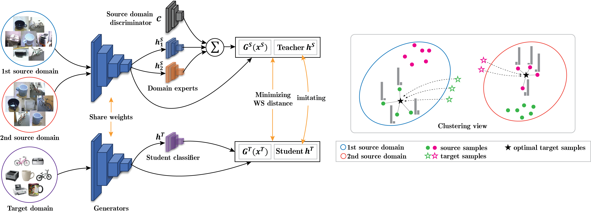

<p align="center">
  
</p>

# MOST: Multi-Source Domain Adaptation via Optimal Transport for Student-Teacher Learning


This is the implementation of the paper **[MOST: Multi-Source Domain Adaptation via Optimal Transport for Student-Teacher Learning](https://auai.org/uai2021/pdf/uai2021.106.pdf)** which has been accepted at UAI 2021.

<p align="center">
  
</p>

## A. Setup

#### **Install manually**

```
Python Environment: >= 3.5
Tensorflow: >= 1.9
```

#### **Install automatically from YAML file**

```
pip install --upgrade pip
conda env create --file tf1.9py3.5.yml
```

#### **Install *tensorbayes***

Please note that tensorbayes 0.4.0 is out of date. Please copy a newer version to the *env* folder (tf1.9py3.5) using **tensorbayes.tar**

```
pip install tensorbayes
tar -xvf tensorbayes.tar
cp -rf /tensorbayes/* /opt/conda/envs/tf1.9py3.5/lib/python3.5/site-packages/tensorbayes/
```

## B. Training

#### 1. Digits-five

We first navigate to *model* folder, and then run *run_most.py* file as bellow:

```python
cd model
```

To run on *Digits-five* dataset, in the root folder, please create a new folder named *features*.  

At the next step, user downloads *Digits-five* dataset [here](https://drive.google.com/file/d/12dUT_xBfikgsjYI6w9FyAKvx1UIz-Ccg/view?usp=sharing) and place extracting files to the *features* folder.

1. "&#8594; **mm**'' task 

```python
python run_most_digits.py 1 "mnist32_60_10,usps32,svhn,syn32" mnistm32_60_10 format mat num_iters 80000 phase1_iters 0 summary_freq 800 learning_rate 0.0002 batch_size 200 src_class_trade_off 1.0 src_domain_trade_off "1.0,1.0,1.0,1.0" ot_trade_off 0.1 domain_trade_off 1.0 trg_vat_troff 0.1 trg_ent_troff 0.1 data_shift_troff 10.0 mimic_trade_off 0.1 cast_data True cnn_size small theta 0.1 sample_size 5
```

2. ''&#8594; **mt**'' task
```python
python run_most_digits.py 1 "mnistm32_60_10,usps32,svhn,syn32" mnist32_60_10 format mat num_iters 80000 phase1_iters 0 summary_freq 800 learning_rate 0.0002 batch_size 200 src_class_trade_off 1.0 src_domain_trade_off "1.0,1.0,1.0,1.0" ot_trade_off 0.1 domain_trade_off 1.0 trg_vat_troff 0.1 trg_ent_troff 0.1 data_shift_troff 10.0 mimic_trade_off 1.0 cast_data True cnn_size small theta 0.1 sample_size 5
```

3. ''&#8594; **up**'' task
```python
python run_most_digits.py 1 "mnistm32_60_10,mnist32_60_10,svhn,syn32" usps32 format mat num_iters 80000 phase1_iters 0 summary_freq 800 learning_rate 0.0002 batch_size 200 src_class_trade_off 1.0 src_domain_trade_off "1.0,1.0,1.0,1.0" ot_trade_off 0.1 domain_trade_off 1.0 trg_vat_troff 0.1 trg_ent_troff 0.1 data_shift_troff 10.0 mimic_trade_off 1.0 cast_data True cnn_size small theta 0.1 sample_size 5
```

4. ''&#8594; **sv**'' task
```python
python run_most_digits.py 1 "mnistm32_60_10,mnist32_60_10,usps32,syn32" svhn format mat num_iters 80000 phase1_iters 0 summary_freq 800 learning_rate 0.0002 batch_size 200 src_class_trade_off 1.0 src_domain_trade_off "1.0,1.0,1.0,1.0" ot_trade_off 0.1 domain_trade_off 1.0 trg_vat_troff 0.1 trg_ent_troff 0.0 data_shift_troff 10.0 mimic_trade_off 1.0 cast_data True cnn_size small theta 0.1 sample_size 5
```

5. ''&#8594; **sy**'' task
```python
python run_most_digits.py 1 "mnistm32_60_10,mnist32_60_10,usps32,svhn" syn32 format mat num_iters 80000 phase1_iters 0 summary_freq 800 learning_rate 0.0002 batch_size 200 src_class_trade_off 1.0 src_domain_trade_off "1.0,1.0,1.0,1.0" ot_trade_off 0.1 domain_trade_off 1.0 trg_vat_troff 0.1 trg_ent_troff 0.0 data_shift_troff 10.0 mimic_trade_off 1.0 cast_data True cnn_size small theta 0.1 sample_size 5
```

#### 2. Office-31

#### Step 1: Train a shallow network using extracted features

Please download extracted features from AlexNet [here](https://drive.google.com/file/d/12EjGgvVdnXAHjqLfceUe1ZFrYkKKA8lp/view?usp=sharing) and save them to the *features* folder.

1. ''&#8594; **D**'' task

```python
python run_most_AlexNet_train_feat.py 1 "amazon_AlexNet,webcam_AlexNet" dslr_AlexNet format mat num_iters 20000 summary_freq 200 learning_rate 0.0001 inorm True batch_size 62 src_class_trade_off 1.0 src_domain_trade_off "1.0,1.0" ot_trade_off 0.1 domain_trade_off 1.0 src_vat_trade_off 0.0 trg_vat_troff 0.1 trg_ent_troff 0.1 data_shift_troff 10.0 mimic_trade_off 0.1 cast_data False cnn_size small theta 0.1 g_network_trade_off 1.0 sample_size 1 num_classes 31 multi_scale "" data_dir ""
```

2. ''&#8594; **W**'' task

```python
python run_most_AlexNet_train_feat.py 1 "amazon_AlexNet,dslr_AlexNet" webcam_AlexNet format mat num_iters 20000 summary_freq 200 learning_rate 0.0001 inorm True batch_size 62 src_class_trade_off 1.0 src_domain_trade_off "1.0,1.0" ot_trade_off 0.1 domain_trade_off 1.0 src_vat_trade_off 0.0 trg_vat_troff 0.1 trg_ent_troff 0.1 data_shift_troff 10.0 mimic_trade_off 0.1 cast_data False cnn_size small theta 0.1 g_network_trade_off 1.0 sample_size 1 num_classes 31 multi_scale "" data_dir ""
```

3. ''&#8594; **A**'' task

```python
python run_most_AlexNet_train_feat.py 1 "dslr_AlexNet,webcam_AlexNet" amazon_AlexNet format mat num_iters 20000 summary_freq 200 learning_rate 0.0001 inorm True batch_size 62 src_class_trade_off 1.0 src_domain_trade_off "1.0,1.0" ot_trade_off 0.1 domain_trade_off 1.0 src_vat_trade_off 0.0 trg_vat_troff 1.0 trg_ent_troff 0.1 data_shift_troff 10.0 mimic_trade_off 1.0 cast_data False cnn_size small theta 0.1 g_network_trade_off 1.0 sample_size 1 num_classes 31 multi_scale "" data_dir ""
```

We will get a model which is saved in folder *MOST-results/saved-model* together with its unique id, or *LOG-ID* will be printed out at the end of training.

#### Step 2: Finetune the entire model including AlexNet and the shallow network.

Some mini-steps should be taken for [finetuning](https://github.com/dgurkaynak/tensorflow-cnn-finetune). 

- Download image data of *Office-31* [here](https://drive.google.com/file/d/1GdbY8GJ-HCp-YrDhDaLC-7BCZ0oxY6G9/view?usp=sharing) and extract them to a new folder named *data* in the root folder. 

- Download pre-trained AlexNet using the following command line, and save it to the *model* folder.

  ```bash
  wget http://www.cs.toronto.edu/~guerzhoy/tf_alexnet/bvlc_alexnet.npy
  ```

Finally, please use your model id which is saved at Step 1 and replace *<your_model_id>* in the following scripts.  The model id is a string ID based on the time of running model at Step 1. It should be, for example, “2021-10-07_02.30.5748”.

1. ''&#8594; **D**'' task

```python
python run_most_AlexNet_finetune.py 1 "amazon,webcam" dslr format mat num_iters 2000 summary_freq 20 learning_rate 0.0001 inorm True batch_size 62 src_class_trade_off 1.0 src_domain_trade_off "1.0,1.0" ot_trade_off 0.1 domain_trade_off 1.0 src_vat_trade_off 0.0 trg_vat_troff 0.1 trg_ent_troff 0.1 data_shift_troff 10.0 mimic_trade_off 0.1 cast_data False cnn_size small theta 0.1 g_network_trade_off 1.0 sample_size 1 num_classes 31 multi_scale "228,256" data_dir "" mdaot_model_id <your_model_id> train_layers "fc7,fc6,conv5,conv4,conv3,conv2,conv1"
```

2. ''&#8594; **W**'' task

```python
python run_most_AlexNet_finetune.py 1 "amazon,dslr" webcam format mat num_iters 2000 summary_freq 20 learning_rate 0.0001 inorm True batch_size 62 src_class_trade_off 1.0 src_domain_trade_off "1.0,1.0" ot_trade_off 0.1 domain_trade_off 1.0 src_vat_trade_off 0.0 trg_vat_troff 0.1 trg_ent_troff 0.1 data_shift_troff 10.0 mimic_trade_off 0.1 cast_data False cnn_size small theta 0.1 g_network_trade_off 1.0 sample_size 1 num_classes 31 multi_scale "228,256" data_dir "" mdaot_model_id <your_model_id> train_layers "fc7,fc6,conv5,conv4,conv3,conv2,conv1"
```

3. ''&#8594; **A**'' task

```python
python run_most_AlexNet_finetune.py 1 "dslr,webcam" amazon format mat num_iters 5000 summary_freq 50 learning_rate 0.0001 inorm True batch_size 62 src_class_trade_off 1.0 src_domain_trade_off "1.0,1.0" ot_trade_off 0.1 domain_trade_off 1.0 src_vat_trade_off 0.0 trg_vat_troff 0.1 trg_ent_troff 0.1 data_shift_troff 10.0 mimic_trade_off 0.1 cast_data False cnn_size small theta 0.1 g_network_trade_off 1.0 sample_size 1 num_classes 31 multi_scale "228,256" data_dir "" mdaot_model_id <your_model_id> train_layers "fc7,fc6,conv5,conv4,conv3,conv2,conv1"
```

## C. Results

#### Table 1: Classification accuracy (%) on Digits-five.

|     Methods     | &#8594; mm | &#8594; mt | &#8594; us | &#8594; sv | &#8594; sy |   Avg    |
| :-------------: | :--------: | :--------: | :--------: | :--------: | :--------: | :------: |
|    MDAN [1]     |    69.5    |    98.0    |    92.4    |    69.2    |    87.4    |   83.3   |
|    DCTN [2]     |    70.5    |    96.2    |    92.8    |    77.6    |    86.8    |   84.8   |
|    M3SDA [3]    |    72.8    |    98.4    |    96.1    |    81.3    |    89.6    |   87.7   |
|    MDDA [4]     |    78.6    |    98.8    |    93.9    |    79.3    |    89.7    |   88.1   |
|  LtC-MSDA [5]   |    85.6    |    99.0    |    98.3    |    83.2    |    93.0    |   91.8   |
| **MOST** (ours) |  **91.5**  |  **99.6**  |  **98.4**  |  **90.9**  |  **96.4**  | **95.4** |

#### Table 2: Classification accuracy (%) on Office-31 using pretrained AlexNet.

|     Methods     | &#8594; D | &#8594; W | &#8594; A |   Avg    |
| :-------------: | :-------: | :-------: | :-------: | :------: |
|    MDAN [1]     |   99.2    |   95.4    |   55.2    |   83.3   |
|    DCTN [2]     |   99.6    |   96.9    |   54.9    |   83.8   |
|    M3SDA [3]    |   99.4    |   96.2    |   55.4    |   83.7   |
|    MDDA [4]     |   99.2    |   97.1    |   56.2    |   84.2   |
|  LtC-MSDA [5]   |   99.6    |   97.2    |   56.9    |   84.6   |
| **MOST** (ours) |  **100**  | **98.7**  | **60.6**  | **86.4** |

## D. Citations

Please cite the paper if MOST is helpful for your research:

```
@InProceedings{tuan2021most,
  author   = {Nguyen, Tuan and Le, Trung and Zhao, He and Tran, Quan Hung and Nguyen, Truyen and Phung, Dinh},
  title    = {Most: multi-source domain adaptation via optimal transport for student-teacher learning},
  booktitle= {Proceedings of the 37th Conference on Uncertainty in Artificial Intelligence (UAI)},
  year	   = {2021},
  abstract = {Multi-source domain adaptation (DA) is more challenging than conventional DA because the knowledge is transferred from several source domains to a target domain. To this end, we propose in this paper a novel model for multi-source DA using the theory of optimal transport and imitation learning. More specifically, our approach consists of two cooperative agents: a teacher classifier and a student classifier. The teacher classifier is a combined expert that leverages knowledge of domain experts that can be theoretically guaranteed to handle perfectly source examples, while the student classifier acting on the target domain tries to imitate the teacher classifier acting on the source domains. Our rigorous theory developed based on optimal transport makes this cross-domain imitation possible and also helps to mitigate not only the data shift but also the label shift, which are inherently thorny issues in DA research. We conduct comprehensive experiments on real-world datasets to demonstrate the merit of our approach and its optimal transport based imitation learning viewpoint. Experimental results show that our proposed method achieves state-of-the-art performance on benchmark datasets for multi-source domain adaptation including Digits-five, Office-Caltech10, and Office-31 to the best of our knowledge.}
}
```

## E. References

#### Baselines:

- [1] H. Zhao, S. Zhang, G. Wu, J. M. F. Moura, J. P. Costeira, and G. J Gordon. Adversarial multiple source domain adaptation. In S. Bengio, H. Wallach, H. Larochelle, K. Grauman, N. CesaBianchi, and R. Garnett, editors, Advances in Neural Information Processing Systems 31, pages 8559-8570. Curran Associates, Inc., 2018 .
- [2] R. Xu, Z. Chen, W. Zuo, J. Yan, and L. Lin. Deep cocktail network: Multi-source unsupervised domain adaptation with category shift. In 2018 IEEE/CVF Conference on Computer Vision and Pattern Recognition, pages 3964-3973, 2018.
- [3] X. Peng, Q. Bai, X. Xia, Z. Huang, K. Saenko, and B. Wang. Moment matching for multi-source domain adaptation. In Proceedings of the IEEE International Conference on Computer Vision, pages 1406-1415, 2019.
- [4] S. Zhao, G. Wang, S. Zhang, Y. Gu, Y. Li, Z. Song, P. Xu, R. Hu, H. Chai, and K. Keutzer. Multi-source distilling domain adaptation. In The Thirty-Fourth AAAI Conference on Artificial Intelligence, AAAI 2020, The Thirty-Second Innovative Applications of Artificial Intelligence Conference, IAAI 2020, The Tenth AAAI Symposium on Educational Advances in Artificial Intelligence, EAAI 2020, New York, NY, USA, February 7-12, 2020, pages 12975-12983. AAAI Press, 2020.
- [5] H. Wang, M. Xu, B. Ni, and W. Zhang. Learning to combine: Knowledge aggregation for multisource domain adaptation. In Computer Vision - ECCV, 2020.

#### GitHub repositories: 

- Folders *alexnet* and *resnet* are cloned from [Deniz Gurkaynak’s repository](https://github.com/dgurkaynak/tensorflow-cnn-finetune.git) 
- Some parts of our code (e.g., VAT, evaluation, …) are rewritten with modifications from [DIRT-T](https://github.com/RuiShu/dirt-t).
